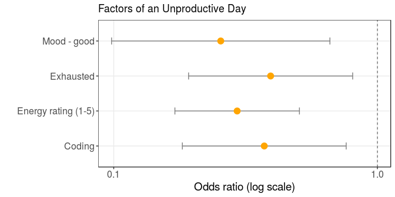
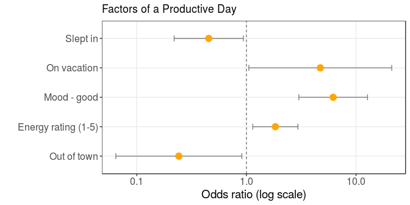

Complementary stats for INST462 final project
================

NOTE: This is not the final project; we are creating an interactive infographic in Tableau. This document is meant to house the statistical analyses that accompany that infographic.

The value we want to predict is the productivity score that I gave myself each day, on a scale of 1 to 5. This is an ordinal value, so we would like to use an ordered logistic regression instead of a multinomial regression. To use this, we first need to test the proportional odds assumption.

We did not meet the proportional odds assumption (the code to find that is hidden, but I hope to show it later; on a deadline right now). Thus, we have to go with a multinomial regression. I binned the productivity score into &lt;=2, 3, and &gt;=4 so that there are more observations in each case.

Below is a table of the variables that had a p-values of less than 0.05, along with their odds ratios.

    ## [1] 0.6166667

    ##  Accuracy     Kappa 
    ## 0.6666667 0.4545024

    ## $overall
    ##       Accuracy          Kappa  AccuracyLower  AccuracyUpper   AccuracyNull 
    ##   6.666667e-01   4.545024e-01   5.833609e-01   7.429546e-01   5.000000e-01 
    ## AccuracyPValue  McnemarPValue 
    ##   3.899557e-05   7.922911e-01 
    ## 
    ## $table
    ##      preds
    ##        3 <=2 >=4
    ##   3   49  10  14
    ##   <=2 10  14   0
    ##   >=4 13   1  33

| variable       | productivity.rating | odds  | p.value | n   |
|:---------------|:--------------------|:------|:--------|:----|
| away.from.home | &gt;=4              | 0.242 | 0.035   | 102 |
| coding         | &lt;=2              | 0.372 | 0.007   | 285 |
| energy.rating  | &lt;=2              | 0.294 | 0.000   | 576 |
| energy.rating  | &gt;=4              | 1.835 | 0.012   | 576 |
| exhausted      | &lt;=2              | 0.394 | 0.011   | 248 |
| moodgood       | &lt;=2              | 0.255 | 0.005   | 255 |
| moodgood       | &gt;=4              | 6.181 | 0.000   | 255 |
| moodsad        | &gt;=4              | 0.000 | 0.000   | 32  |
| on.vacation    | &gt;=4              | 4.716 | 0.043   | 61  |
| slept.in       | &gt;=4              | 0.453 | 0.033   | 182 |

