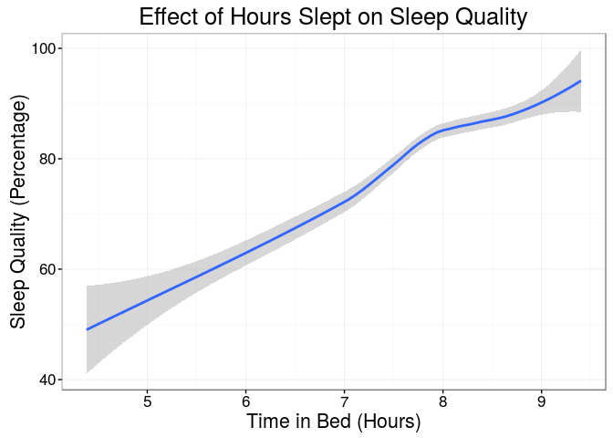

# Self Analysis
Mikey Saugstad  
November 7, 2016  


## Data Prep


#### Reading Data

```r
#
# READING SLEEP DATA
#

sleep.data <- read.csv2("data/sleep_data-subset.csv")


#
# READING SELF-RECORDED DATA
#

# If having trouble with loading xlsx or rJava, try running rstudio as root
library(xlsx)

# The read.xlsx function has not been very good at coercing the data when the
# correct types are passed in (most of them are booleans), so I coerce almost
# everything to character, and then do some extra work when cleaning to get
# it all to the correct types.
classes <- c("Date", replicate(44, "character"))
self.data <- read.csv2(file = "data/self_data-subset.csv", colClasses = classes)
```

#### Cleaning Data

```r
#
# CLEANING SLEEP DATA
#

# Convert to correct data types
sleep.data$End <- as.Date(sleep.data$End)
sleep.data$Sleep.quality <- as.numeric(sub("%","",sleep.data$Sleep.quality))
sleep.data$Time.in.bed <- as.difftime(as.character(sleep.data$Time.in.bed), format = "%R")

# Use the date when I woke up to figure out which night I went to bed; I may
# go to sleep after midnight, so start date may not always give the correct
# date, but I always wake up past midnight.
sleep.data$Date <- sleep.data$End - 1


#
# CLEANING SELF-RECORDED DATA
#

# Optionally combine the drank coffee and took caffeine supplement
#mydata$coffee <- as.logical(as.numeric(mydata$coffee)) | as.logical(as.numeric(mydata$caffeine))

# Coerce remaining cols to correct types.
# TODO figured out a way to do this using col names instead of indices
binary_cols <- c(3:13,15:18,20:25,27:36,38:44)
numeric_cols <- c(2,14,26)
factor_cols <- c(19,37)
for(i in binary_cols){self.data[,i] <- as.factor(as.logical(as.numeric(self.data[,i])))}
for(i in numeric_cols){self.data[,i] <- as.numeric(self.data[,i])}
for(i in factor_cols){self.data[,i] <- as.factor(self.data[,i])}
```


#### Merging Data

```r
#
# MERGING DATASETS
#

my.data <- merge(self.data, sleep.data, by.x = "Date", by.y = "Date")
```

## Analysis


```r
library(ggplot2)
sleep.v.sleep.qual.plot = ggplot(data = my.data, aes(Time.in.bed, Sleep.quality)) +
  #geom_point() +
  scale_x_continuous() +
  geom_smooth() +
  theme_bw() +
  theme(text=element_text(size=16)) +
  labs(title = "Effect of Hours Slept on Sleep Quality",
       x = "Time in Bed (Hours)", y = "Sleep Quality (Percentage)")
sleep.v.sleep.qual.plot
```

<!-- -->
